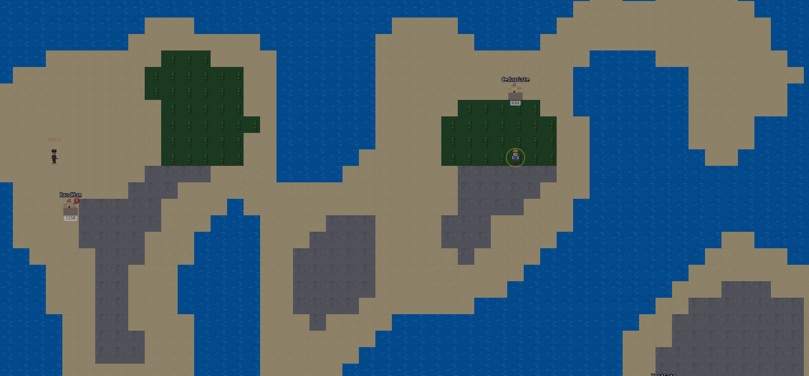

# Bargain Quest

**Bargain Quest** is a turn-based strategy game inspired by *Mount & Blade*, but with a twist: **trade and economics** are the core mechanics.

Instead of battles and conquest, you rise to power through smart market moves, supply and demand, festivals, and negotiation. Travel between cities, manage your inventory, exploit seasonal trends, and become a trade tycoon in a living economy.

# Includes 
- basic economy 
- NPCs for trading and turn based combat

# Demoing the game or running 
open game.html in a live server 

[itch Demo](https://magentaautumn.itch.io/bargain-quest?secret=lttUL2Dty90R7A501pSZ0pfZWu4)

## 🖼️ Screenshots

---

